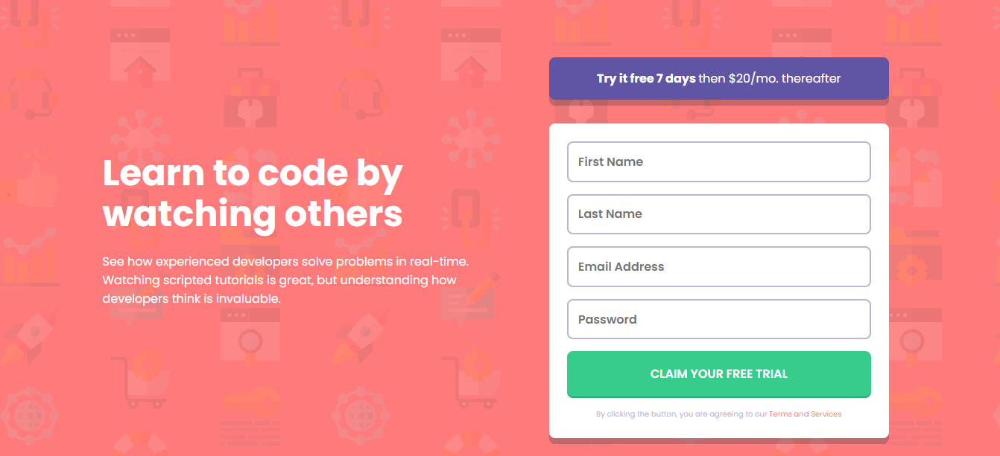

# Intro component with sign up form

[Check out this challenge](https://www.frontendmentor.io/challenges/intro-component-with-signup-form-5cf91bd49edda32581d28fd1).

## Table of contents

- [Overview](#overview)
  - [Problem Statement](#problem-statement)
  - [Desktop Preview](#desktop-preview)
  - [Mobile Preview](#mobile-preview)
  - [Links](#links)
- [My process](#my-process)
  - [Built with](#built-with)
  - [How I went for the implementation?](#how-i-went-for-the-implementation?)
- [Useful resources](#useful-resources)
  - [Learn](#learn)
  - [Fonts](#fonts)	
  - [Colors](#colors)
- [Author](#author)
- [Credits](#credits)

## Overview

### Problem Statement

### Desktop Preview

### Mobile Preview

### Links

- [Github](https://github.com/)
- [Netlify](https://www.netlify.com/)

## My process

### Built with

### How I went for the implementation?

## Useful resources

### Learn

### Fonts

### Colors

| Colors                 |                              HSL Value                                |
| :--------------------- | :------------------------------------------------------------------- |
| Black                  |  hsl(0, 0%, 0%)      |

## Author

- [Website](https://omkakatkar-portfolio.netlify.app/)
- [Frontend Mentor Profile](https://www.frontendmentor.io/profile/OmKakatkar)
- [Twitter](https://twitter.com/omkakatkar)

## Credits

- [Frontend Mentor](https://www.frontendmentor.io/)
