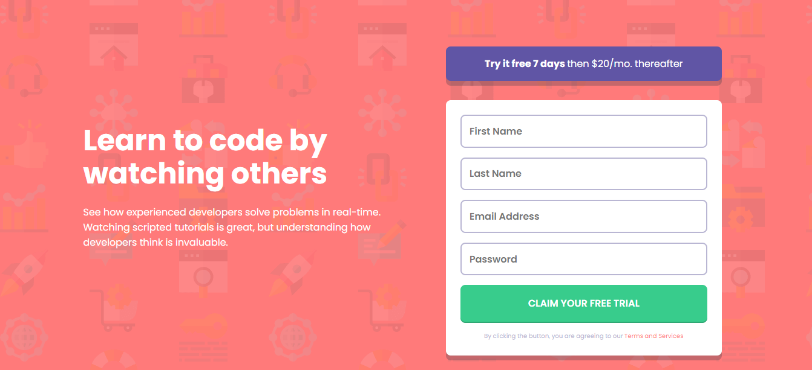

# Intro component with sign up form

[Check out this challenge](https://www.frontendmentor.io/challenges/intro-component-with-signup-form-5cf91bd49edda32581d28fd1).

## Table of contents

- [Overview](#overview)
  - [Desktop Preview](#desktop-preview)
  - [Mobile Preview](#mobile-preview)
  - [Links](#links)
- [My process](#my-process)
  - [Built with](#built-with)
  - [How I went for the implementation?](#how-i-went-for-the-implementation?)
- [Useful resources](#useful-resources)
  - [Learn](#learn)
  - [Fonts](#fonts)
  - [Colors](#colors)
- [Author](#author)
- [Credits](#credits)

## Overview

### Desktop Preview

### Mobile Preview

### Links

- [Github](https://github.com/OmKakatkar/intro-component-with-signup-form)
- [Netlify](https://sign-up-form123.netlify.app/)

## My process

### Built with
- HTML5
- Vanilla JS
- CSS Grid
### How I went for the implementation?
Initially I struggled a bit with the overall implementation and the form validation part. Then I started breaking the problem into parts which were easy to work with.
- First I made a rough sketch for parts and sections on a piece of paper.
- Then I built a basic HTML structure with the design with a Mobile First approach
- Extended the styles for Tablet and Desktop
- Added styling for error handler
- Finally, did the form validations as per the requirements

It took some time, but learnt a lot. 
## Useful resources

### Learn

- [Form Validation](https://youtu.be/rsd4FNGTRBw)
- [Select Sibling](https://www.javascripttutorial.net/javascript-dom/javascript-siblings/)
- [Add Class](https://www.w3schools.com/howto/howto_js_add_class.asp)
- [Remove Class](https://www.w3schools.com/howto/howto_js_remove_class.asp)

### Fonts

- [Poppins](https://fonts.google.com/specimen/Poppins)

### Colors

| Colors       | HSL Value                                                            |
| :----------- | :------------------------------------------------------------------- |
| Red          |  hsl(0, 100%, 74%)  |
| Green        |  hsl(154, 59%, 51%) |
| Blue         |  hsl(248, 32%, 49%) |
| Dark Blue    |  hsl(249, 10%, 26%) |
| Grayish Blue |  hsl(246, 25%, 77%) |

## Author

- [Website](https://omkakatkar-portfolio.netlify.app/)
- [Frontend Mentor Profile](https://www.frontendmentor.io/profile/OmKakatkar)
- [Twitter](https://twitter.com/omkakatkar)

## Credits

- [Frontend Mentor](https://www.frontendmentor.io/)
